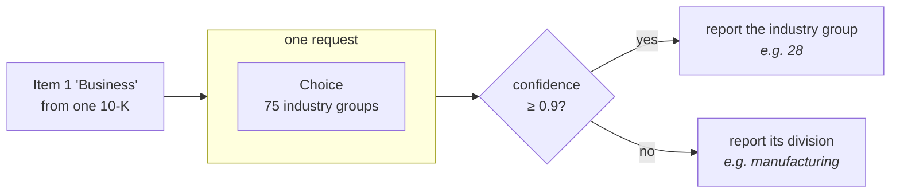

> ## Documentation Index
> Fetch the complete documentation index at: https://docs.typesafe.ai/llms.txt
> Use this file to discover all available pages before exploring further.

# Classification using confidence

> Classify SEC annual reports into 75 industry groups with one Choice each, then read the answer's own confidence to decide whether to report that group or the broader division above it.

Every company that files an annual report with the SEC describes its own business in it. We
classify those descriptions under the Standard Industrial Classification: 75 industry
groups, one `Choice` question per document.

Most filings are easy. A regional bank is a regional bank. Some are not: a company that
just sold one of its two segments, or a startup describing a business it plans to enter
rather than one it runs. The model has to pick a group regardless, and the answer for a
hard case looks no different from the answer for an easy one. Telling hard cases from easy
ones is normally where the cost goes: a second model, extra calls, human review.

A Choice already tells you. Alongside the winning option it returns `confidence`, high when
nearly all the probability landed on one option and low when it spread across several. That
one number separates the answers you can trust from the ones you can't.

What to do with an untrusted answer depends on your labels. SIC labels form a hierarchy:
industry groups roll up into broader divisions. That makes one response nearly free. When
the model is unsure of the group, report the division it belongs to. The broad label
follows from the narrow one, so there is no second call.

Across 60 filings, a confidence cutoff of 0.9 splits them in half. The confident half is
right 90% of the time; the other half, 40%. Reported one level up, that 40% becomes 70%. We
end with a `classify()` function that returns a label plus how specific it is, at one
request per document.



## Setup

```bash theme={null}
pip install ipython matplotlib 'cooksafe>=0.2.0,<0.3.0'
```

then set `TYPESAFE_API_KEY`. Every API call is cached to `json_cache.json`, which ships
with the cookbook, so re-rendering replays the published numbers without calling the API.
Delete that file to re-run everything live.

Numbers below came from `jev-1.12` on 2026-08-12.

```python theme={null}
import json
from collections import defaultdict
from pathlib import Path

import matplotlib
import matplotlib.pyplot as plt
from cooksafe import JsonCache, make_playground_link
from IPython.display import Markdown, display
from typesafe_sdk import Choice, TypeSafeClient

matplotlib.use("Agg")  # headless render

import os  # noqa: E402

TYPESAFE_MODEL = "jev-1.12"
CONFIDENT = 0.9  # above this the group is reported; below it, the division

client = TypeSafeClient(
    api_key=os.environ.get(
        "TYPESAFE_API_KEY", "cache-only"
    ),  # keyless kernels replay the cache
    base_url=os.environ.get("TYPESAFE_ENDPOINT"),
    timeout=120.0,
)
json_cache = JsonCache(Path("json_cache.json"))
```

## Build the two levels of the taxonomy

`sic_codes.tsv` is the industry list the SEC publishes for filers to pick their own code
from, fetched 2026-08-10: 444 four-digit codes, each with an industry title. The digits are
a hierarchy. The first two are the **major group** (75 of them here, from `01` agricultural
production to `99` non-classifiable), and fixed ranges of major groups make up the ten
**divisions**, the broadest split SIC has.

Both levels come out of that one file with no model involved: group the codes by their
first two digits, then map those digits to a division.

```python expandable theme={null}
DIVISIONS = [
    (1, 9, "agriculture, forestry and fishing"),
    (10, 14, "mining"),
    (15, 17, "construction"),
    (20, 39, "manufacturing"),
    (40, 49, "transportation, communications and utilities"),
    (50, 51, "wholesale trade"),
    (52, 59, "retail trade"),
    (60, 67, "finance, insurance and real estate"),
    (70, 89, "services"),
    (91, 99, "public administration"),
]

INDUSTRIES: dict[str, str] = {}
for line in Path("sic_codes.tsv").read_text().splitlines()[1:]:
    code, _office, title = line.split("\t")
    INDUSTRIES[code] = title.lower()

GROUPS: dict[str, list[str]] = defaultdict(list)
for code in sorted(INDUSTRIES):
    GROUPS[code[:2]].append(code)


def division(group: str) -> str:
    number = int(group)
    return next(name for low, high, name in DIVISIONS if low <= number <= high)


print(
    f"{len(INDUSTRIES)} industries -> {len(GROUPS)} major groups -> {len(DIVISIONS)} divisions"
)
print(
    f"  group 35 = {division('35')} / {', '.join(INDUSTRIES[c] for c in GROUPS['35'][:3])} ..."
)
```

```
444 industries -> 75 major groups -> 10 divisions
  group 35 = manufacturing / engines & turbines, farm machinery & equipment, lawn & garden tractors & home lawn & gardens equip ...
```

A Choice question needs something to describe each option, and a group's own name is not
always
there: 42 of the 75 carry an umbrella title in the SEC's list, and the rest carry none. So
each group is described by the industries inside it, which is what someone reading the
filing would match against anyway.

```python theme={null}
MAX_NAMED = (
    8  # industries listed per group; enough to characterise it without a wall of text
)


def describe(group: str) -> str:
    umbrella = INDUSTRIES.get(f"{group}00")
    inside = [INDUSTRIES[c] for c in GROUPS[group] if c != f"{group}00"][:MAX_NAMED]
    listed = "; ".join(inside)
    return (
        f"{umbrella} — includes: {listed}"
        if umbrella and listed
        else (umbrella or listed)
    )


print(f"group 20: {describe('20')[:150]}")
print(f"\ngroup 65: {describe('65')[:150]}")
```

```
group 20: food and kindred products — includes: meat packing plants; sausages & other prepared meat products; poultry slaughtering and processing; dairy product

group 65: real estate — includes: real estate operators (no developers) & lessors; operators of nonresidential buildings; operators of apartment buildings; less
```

## The filings

`filings.jsonl` holds 60 annual reports (10-K), each trimmed to Item 1 "Business", the
section where a company describes what it does, which is the only part an industry code is
about. They span 1993–2024 and run from 700 to 2,200 words. Each one carries the SIC code
its filer chose, plus the accession number to look it up on EDGAR.

Where that label comes from matters before any accuracy number. It is self-reported:
whoever prepared the filing picked it once, and it goes stale when a company sells the
business the code names and keeps the code. These 60 were filtered down to filings whose
own text supports the code they carry, so the numbers here measure the recipe rather than
the state of EDGAR's metadata.

```python theme={null}
FILINGS = [json.loads(line) for line in Path("filings.jsonl").read_text().splitlines()]
example = FILINGS[7]
print(
    f"{len(FILINGS)} filings, {sum(f['words'] for f in FILINGS) // len(FILINGS)} words on average"
)
print(f"\n{example['id']} (filed {example['year']}, accession {example['accession']}):")
print(f"  {example['text'][:230]}...")
print(f"  filer's code: {example['sic']} {INDUSTRIES[example['sic']]}")
```

```
60 filings, 1438 words on average

1389870_2008 (filed 2008, accession 0001079974-09-000155):
  Item 1. DESCRIPTION OF BUSINESS. NARRATIVE DESCRIPTION OF THE BUSINESS Across America Financial Services, Inc. is a corporation which was formed under the laws of the State of Colorado on December 1, 2005. Until March 23, 2007, we...
  filer's code: 6163 loan brokers
```

## Ask one Choice question, and read the confidence

One `Choice` question whose options are the 75 groups. The whole taxonomy fits in one
request: a Choice works reliably up to roughly 240 options, and 75 is well inside that.

The answer comes back with `choice`, the winning group; `probabilities`, the weight on each
of the 75; and `confidence`, which says how concentrated that spread was. The recipe reads
`confidence` rather than the winner's own probability. A winner at 0.45 with a runner-up at
0.44, and a winner at 0.45 with the rest of the weight scattered thinly, are different
situations, and `confidence` is what separates them.

```python theme={null}
QUESTION = (
    "Which broad industry does this company operate in? Judge the company's own operations "
    "as this filing describes them."
)


def questions() -> dict:
    return {
        "group": Choice(
            instructions=QUESTION,
            criteria={group: describe(group) for group in sorted(GROUPS)},
        )
    }


@json_cache
def ask(filing_id: str, text: str) -> dict:
    response = client.system_one(
        state=text, questions=questions(), model=TYPESAFE_MODEL
    )
    answer = response.answers["group"]
    return {
        "group": answer.choice,
        "confidence": answer.confidence,
        "probabilities": dict(answer.probabilities),
    }
```

## Return the group when sure, its division when not

The four lines below are the whole recipe. At 0.9 confidence or above, the answer is
reported as an industry group; below that, the same answer is reported as the division that
group sits in.

Every filing still comes back with a usable label. One the model could not classify
confidently comes back one level up instead of being dropped or sent on. If a division is
too coarse for your application to act on, this branch is where you hand it to a person.

```python theme={null}
def classify(filing: dict) -> dict:
    answer = ask(filing["id"], filing["text"])
    sure = answer["confidence"] >= CONFIDENT
    return {
        "level": "group" if sure else "division",
        "label": answer["group"] if sure else division(answer["group"]),
        "confidence": answer["confidence"],
        "group": answer["group"],
    }


def show(filing: dict) -> None:
    result = classify(filing)
    named = describe(result["group"]).split(" — ")[0][:46]
    print(
        f"  {filing['id']:>13}  conf {result['confidence']:.2f}  -> {result['level']:<8} "
        f"{result['label']:<14} (group {result['group']}: {named})"
    )


print("three filings the model was sure about:")
for f in sorted(FILINGS, key=lambda f: -ask(f["id"], f["text"])["confidence"])[:3]:
    show(f)
print("\nthree it was not:")
for f in sorted(FILINGS, key=lambda f: ask(f["id"], f["text"])["confidence"])[:3]:
    show(f)
```

```
three filings the model was sure about:
    310158_1996  conf 1.00  -> group    28             (group 28: chemicals & allied products)
     33416_1998  conf 1.00  -> group    63             (group 63: life insurance; accident & health insurance; h)
    352541_1996  conf 1.00  -> group    49             (group 49: electric, gas & sanitary services)

three it was not:
   1372167_2013  conf 0.22  -> division manufacturing  (group 38: search, detection, navagation, guidance, aeron)
   1398633_2009  conf 0.23  -> division wholesale trade (group 50: wholesale-durable goods)
     46653_1999  conf 0.29  -> division services       (group 87: services-engineering, accounting, research, ma)
```

The confidences line up with how hard each filing is to classify. The three at 1.00 are a
pharmaceutical maker, a life insurer and a utility; all three are holding companies on
paper, but each has one dominant business the filing names outright. The three at the
bottom are harder for reasons you can read in the text. Two are development-stage companies
describing a business they intend to start (Nevaeh "intends to operate as a software
developer", Barricode was "organized to enter into the computer security software
industry"), and the third had two segments and sold one of them weeks before filing. Those
three come back as a division rather than a group.

`classify()` is the whole recipe. Point `ask()` at your own documents and rewrite
`describe()` for your own taxonomy, and the rest carries over.

## What the broader answer buys

All 60 filings, scored against the code each filer chose, under both policies: name a group
every time, or report the division whenever confidence lands under 0.9.

```python theme={null}
def correct(filing: dict, result: dict) -> bool:
    gold_group = filing["sic"][:2]
    if result["level"] == "group":
        return result["label"] == gold_group
    return result["label"] == division(gold_group)


results = [(f, classify(f)) for f in FILINGS]
sure = [(f, r) for f, r in results if r["level"] == "group"]
unsure = [(f, r) for f, r in results if r["level"] == "division"]

forced = sum(r["group"] == f["sic"][:2] for f, r in results)
broadened = sum(correct(f, r) for f, r in results)

print(f"forced to name a group every time      {forced}/{len(results)} right")
print(
    f"  of those, the {len(sure)} it was sure about  "
    f"{sum(r['group'] == f['sic'][:2] for f, r in sure)}/{len(sure)} right"
)
print(
    f"  and the {len(unsure)} it was not           "
    f"{sum(r['group'] == f['sic'][:2] for f, r in unsure)}/{len(unsure)} right"
)
print(
    f"\nletting it answer coarsely when unsure  {broadened}/{len(results)} useful answers"
)
```

```
forced to name a group every time      39/60 right
  of those, the 30 it was sure about  27/30 right
  and the 30 it was not           12/30 right

letting it answer coarsely when unsure  48/60 useful answers
```

Where the model was sure, the group it named is right nine times in ten. Where it was not,
naming a group was wrong more often than right, at 40%. Reporting those same answers as a
division takes them to 70%.

The chart puts the two policies side by side, split by whether the model was sure.

```python expandable theme={null}
labels = ["sure\n(group reported)", "unsure\n(division reported)"]
forced_split = [
    sum(r["group"] == f["sic"][:2] for f, r in sure) / len(sure),
    sum(r["group"] == f["sic"][:2] for f, r in unsure) / len(unsure),
]
broad_split = [
    sum(correct(f, r) for f, r in sure) / len(sure),
    sum(correct(f, r) for f, r in unsure) / len(unsure),
]

fig, ax = plt.subplots(figsize=(7, 3.6))
x = range(len(labels))
ax.bar(
    [i - 0.19 for i in x],
    forced_split,
    0.38,
    label="always name a group",
    color="#c8ccd4",
)
ax.bar(
    [i + 0.19 for i in x],
    broad_split,
    0.38,
    label="answer broadly when unsure",
    color="#3b6ea5",
)
for i, (a, b) in enumerate(zip(forced_split, broad_split)):
    ax.text(i - 0.19, a + 0.02, f"{a:.0%}", ha="center", fontsize=9)
    ax.text(i + 0.19, b + 0.02, f"{b:.0%}", ha="center", fontsize=9)
ax.set_xticks(list(x))
ax.set_xticklabels(
    [f"{lab}\nn={n}" for lab, n in zip(labels, [len(sure), len(unsure)])]
)
ax.set_ylabel("labels that are right")
ax.set_ylim(0, 1.12)
ax.set_title("Where the broader answer helps: the filings it was unsure about")
ax.legend(frameon=False, loc="upper right")
ax.spines[["top", "right"]].set_visible(False)
plt.tight_layout()
display(fig)
```


## Open it in the playground

This share link holds one filing and the 75-option question, so you can see the
distribution and the confidence it produces without writing any code.

```python theme={null}
playground_link = make_playground_link(
    example["text"], questions(), models=[TYPESAFE_MODEL]
)
display(
    Markdown(
        f"🔗 [Open the filing + question in the TypeSafe playground]({playground_link})"
    )
)
```

<a href="https://console.typesafe.ai/playground#share/N4IgJg9gxgrgtgUwHYBcAqCAeKQC4AEIAkignPgIwB0+AIgKIDKAwgEpEAKaRA8gHL4eAMXwAhAKqMifJoxp8Agq1YLuANXp0mbTt36CRaABKaJUmY0b4FUAE4QAzg+uJbASygBDfELdJPSFBungA2+IwItgBuHggOADT4RIE0bs7eUBC2AA5ZnihuEEj4AO4AFh5lpZ7OAGZZiGD4MEhgkfgoZQj4IZ4lzhC1HV3hKPndg-jMECF5kPhFdAhQZABG7RSJAEwADDsArDTiqG5hALKetlBVWwDM23sA7Ikl3a+23d7lMyEAngC0EBKSAQTQcMFWDjcYGCtl+CyGzE82VItls3l8-kCwTCAHF7DBsolklAqIl6rZXH98ABrJBA4o1ax2RzOBSuDzeVgIUL4egOMakKZZbJUAAUgBwCZgKLiAXAIAJQ0HjFABSARgl3hFB2Dx2z2G3RhHygKCyA0RMrQ+GR2XsUVBiXBqwAVssUB0IAb8AharU3W57SCnAjrfgPgBzNIodEFRYlNydL0RWDuApxa2tPmYa4BcPdaZwOBpKFFRKdbq2z0x7wObJ+QG+kM2ezB9mRTk+PwBIK8iLRWIJJIpfBizHdnHhSIxFYOeUeqaW-AOMqXBBlGZtWzmsPLLJNRYXK5VTb4XZ6haM-CVsP5byrGppGiMPwrBdcQCYBM5VjAoUHnGkd16UgmlNL1K1yBxQWtE0AwTNx00mMdsV7KcBy9aUuHwI03TNLDlmhKCE2qf9inLfB1gFfA-FROJ3UmDCrQCJokJ7MI+2ndMmLfNBPyXFcPnXEJN2cUDa3rQYhhYid2LQ0CiyQNwiwAL0+JB4VyUgTl5SZMiQWoQg8OihmoyJaJoNARmXVdtyklD+xnUpTIWYEoNWeEGJedcsKjdxv2A0NTTGMJJk2AAObV4gAFkeAA2PjrPnMiGPigSN0iAZiiya1VggGB3UPa5T3uU8niVVV1U1Sgtl1fUAgWWxwwCNwlPyQpin8Rpwk8P18CMS4ctsJJEgAGWG5gyXwCkqXhOkGWtZxGG67o+tsAaxB-Pw4mcWgEHtWZskQVBhTgbIAnhSVFp6laBoVTzKio9JfVOYJ-PjRNcsG3oGtolK1zS2xElxWhRAUId7QFQ6UEHUbmESTxww+KDQMrGI2gWbJIlapBw3wLw6yCqjSJGKaQ28WY6smAASLZ9h1PYdnnTJ7UGiAMZjPwcawDGkEghxzIqZxyeKEomTAGAJnKpANThKqHm1GgjCBXbIkSH0-Rg+1BBNCB1kGigYt1UKXgrTxoQRIYyNtF83FOsIuM8KA7HFpoTI+SixYlhYYE+iA6tAy7lv6rKdr21nIeO061Lh9InDccMQRAz0A96oO9ZGsaaAUd0yIcTxEA6RSEGN71UFMl3UE9MnfcZNFczIZB3TeqoAHUfrOXLUFN4oOHcRB0-Gu7CoA7rame8Ymibr3Bp7uICNQRIzlsGgAGkQjIBwlJoVvyKyexXiaSmKFuar6cm+xyFbyj25aMY-HwHvC-7+cUYI9HMYKbHceRBNeVApn2lZu-Dm3pMDc15vzACQsHrelRsgFYTQ3IZmaDzZY3soKViLE4LI8J6RCjFGRCUfAICkAVKUCoQ9nD0hKFhcWWtTS60oAbEqOwACciQWhr2DLpZmwFM4hDCFbbEtsMzlxopRB2Tt0w31OF6IhQoAIe3qrjIoPDQT80+NkbIBkvCrDXoTMR7oYyezInI7oAEKBbAAKRXnaAEKW5AsArBRITL0ysjqdHyI5Sapswh-xUZEd0Z0rxZFjJlC2IxBFBGEVxU68IyKux+oou+5R7peEgl6G02jPC6O6EYi8sjiHdCsvwg0HxuqonIt0CgoVrFswzPYzOgS1IF3zlbLKoEyKKLAOMEMJjClwxKblKGYxWjAMiTbXkLRNwFKFHATwvw4bZ0sjMCYKI2q9JGIrISKtKnKKQKo0RnoPrKMLIsKybtvQAEcNS+M9GRIZAomJjPcEI3kecO5GS9Lgw0sE2gIPhFQLYWwaD-HwLcfAoKOCsB4BwHgjB6C0EEBwegKg9B8CsNvVcoY2ihwOg3JcYw8wnMjr8JU3s8K4vDo8ol6xGrCy6MLDRKMoLHO-L+LaV5eiZWKEQ+0cAGFsOYTFMlg0tF1RFiJSuJp5qhjgCExqNL7A0naBSE5rhWI7l5LRHp0YAi5xgkUPmggeUQD5Qwig+ozxGy8Q3Mu+jK7FAUAjBA9cjqTDOJEPMg0uIcC5SGbkWQ6XNVanGBMVQZTQrEIUe+-E5krDypyMI0wch5FCSOCNPB5RwyvO4KIPTpizHRPMTIKb2aljIaZRBxzvj8IBAyKCTooQwk1IkZsrIXDti8Mya5aQ4KLGTaKF4uUhL4FcESyeGaXhhusFCnglTgE529jEGIn8G4JlJTOyNJRh0gQZZUzI+dq2CT+ICFyYIIRNthBu8QuRihQFmL+HGZEx07NeKUHdD1wSfA9ATEKRtqlsMijFLYv1JVegzb9QSwkXGOJXNjboqrQjBXCQgNwet-2hUA8Bz9zsRFe2GU8z+5y4hlVDLUGAtbEgwhCHlVyD5BxkQg8RqD6V30Uf3MCAKxDtJDF2PECgQH4gsOw8R7cBYSXHTlcURgpooA0kzukHc4IQifM6ABXVPMHahOLtu9j+AVya28IFHj1pNH2EwIpcY1I7ijtOAZM5-EEKIggKc6TsmaQ4aglxB5IyYTYyOLer097HDAMmM+z1Oz7lPRWFuPD2FtaxcmBB3TI71gHomOSiSsRYtcXi6aLcIqlwrPNtluLaGcIA3wIvFea84AbyHXpt2cdihq39IZpZ3QCiHqGMFx96iTmrE2k0A9EmUv7jZj0qZ7QyIdW6AoJSpBCqiEKA4IIcCi5DlJIkLKDgXOGnbHmtN5YPiDH6710L4T1Pok0wa4oAEnSumlX-AJXc9kfzzNiOI0dR1ZAQxR6kMJVs-kguXcDzrXWfI9d9b1mZfUUyGAGhqTUWrabw2RD4PaPjh0mJ4GAMJ-KjyxBqx5pBIZ1HPpungAyig40nmRG0doTNkQ0-qtNiCc6OZY4loYEGuJJRcySzOs7oFkW0cgSCEwhijzXggvK+BcH4F+Agd0xZcOnU0lDQC49GYC5C2myYcyUAVK4ogToEB9xDB-Ah9pZT3vkS0+2Xkfh1ZppfDRvzON7wmkdwIkE8AijBDLBCSIsAH3D0zAETo6JMCExd21I1EGVzpBCLtnosQUFNDqlgKMYzxhHVVcz232OhgxHRGEZ3-pFhu7x8AowRA1DEj0jR5ALU8MaTXUhuJIwJSDdsE0fSMBZT4FLz+IXkaxU83nA7THqkmg4oQPtEBOfP5cXpHtUp390wePdF4YocrNZR9yuGKo96-CJo6O4UIzge1yb+I6Lo2Quh94XV0cgh+YDH69EIWgoMGemt5JWDOLzHhp4GAHmtiJ-OWG-mUASJ-geuqjiMGqEjQGcEoMvPQGgBip8B8LjN7B8KgNSPULACDvkqBFpjKt4HKrYCgAqt0KsEqiqllPASHhOGUmENqkKCzlpvHqUNOt+KcGAP8KaP8OCERI+noqdGAI6HMiUjlDHh8LfAIvYI9prqqv4KEm8pmBGG1LyAoT4qxu-sfkMl6McAmFBDJuMEamgJ6N0qQMXAZt0CuE0PSNBAUJrIAmWjzDQLQN7MAlalPASkYuGPCPGCUkQT+PkvPvtMAt4JWCoVeDbAvptDQCoM3FVqoCikQAoMNFYBZN0FbiGOiNQobj7v+JQsQrKuMJfmELUFpllHfMch4SGpPp4pbG7Pil1ggFvIaJ6ArlzG6DeMUVUTiGBusJUaiBOLUQli4mRORigGgjQMwJIGgDwGcCilYAoHwIiswKscitwGioIOSmyptMGBPoTFEDMODK4TEYplQTQfDHQQwYNKqswVcKwTyOwSTp1tdqzvHhAl+BtH+NAhUMftSCNsrnBPaOojgVivYpELlM4FCEWF9MSk1OmC-B7kuDAIVJBPZOmHfGRKYf5BYaQNuG2O4F4IVuCQUPls4KEWEA4fgM6lUZNF2MhGEG7B9A5Cbr9iAmzAUOkgSQLORICVtIVtks9CgHEjYcrIvscncbQeRE8Q8SKeysGPSXhNzPuJlOShKQZFKfOOCI7FtORrWqOpcMqnROSriRxCRMMABCCWUGCQLhCW4d0MgKXkUJDIsXgQ3Hfl4oyS4cQaaK4HUFlMcjaQON0V-EgAruGNLJHi6sMJ4m+hqWMdknoqBPMKnkaUAaaX8DQCDMwMvMNDwLiNYO6DtCsPyu0LcCeFavYaAfLp6F7jSLMOGEaqCpFBCnyGcBwKWQAJr0BMD4DbyBmehkBaIQBK4ITHbJnFDVb4CrzrxKTbbkozxNr4pcTJh6Fwj-BoBlLggfBLy9QVhcpgY4qFI9AcoeLFD7DWKTDCmdHzisqilODRlnGgQfCKTfhbgZaDRYCoJulhneolIghAGVRcTBkuaVTHFAkfBARQT9EoJGo8DkqIA1ksxDBzL+B5jhzfDWgp6eg2kIREzdCiC+x947grABjpguGgH446FhDgmaZpqIZG7ICYkUWXBNCIAQnYxGqzpQpEAYFKADlJB8BCA8CsCoEHHbxzQuHgTuDK6VTO4NDNE0C4g8AaCsB8BrF8BWisD0C4jiDDSqC8ACDPiBBvASzUjkFCndB4wOzrqkxKkQDKqVZvrzB9GgIDHhimqRBIDhwRgUbNEDCfR9BgaMlBIlHVFUQnTkGLCj74BGXwpKDMBGDWBbFaAaClkcD6VWhjmeCawgjMxLjcxNLwjvI3wuLtGXCFS5aylhxbkaxwQkZ8h8BqBEDQp6X0AGXZFTC7HDRZF8DMCaBWWvhvpFB2XSoOVfynRBAGk45uUeXFzeUVH9HSoeloZekNy8i9D9DzjRXNKxUTiKQLV0TFDJVGA8BpErGCCiBoAKDSCCDiCsDhD0DMA+BEDDV8C4hYGsl6J2I3KJDXKXCoj+lcS1j4S6EIC5DUGDiViYDwhfFk5wyZjEJP6x7qVpp04jDJi+FpjOD0DZhwZEoFiYIljFBijwrMCKgpVw0hKI3mYo2CgQ7pAY1zlqWUjNGA1QR43dC00xm7J+DQ3e6Z6ZiZB1heYdZXgQjaI7h+j4GvhTGSnwTbhkRC2eLagMwiAyaIzuh8BUD0ATTNw1AVDYymhICJC0BfW7D7CRQsJPjYlVCnW8hzJVVEW7ISJbRIVrwmj2AKReBmmIKIB6obKC2fUADkdJCAkIZh1ojcJQJQVAkEpI-lUQhWfg4M+WWuoSzgbQp01B4cu+uyukYw4tidAR4ywigFsAbpJWr4swXg-knixyNdPGo8r4Fi4KRC1BVQBaa8RKCggYtCjAMACdZ4iQQgISwo-CotiQBacwnooUBwWwkUhWj+RQ3Q9iDCbd5KXQoBYN1BrGAEYoLCjwOwc4+wtwOw-wOwx8hwo5jlvpBB8I45jk8dpAT44gog8KAAiuIH1VaPQBoAZcavgLymsBsJansNam+rah8Ickgk6ojMXlVhFjDk0HDmEgzYGsjrzROsLstp6BwLGg7AgAmsHcKKWrzWKBmlmqGFbIdvmDMMvcorQ6juUJWvCEej8HWmelifHc2nCK2iyK2ByF2jYD2lCGmgOhNGNqOhFrwYmJOio+GsLusC-kUkurBKuicFKWPnOoo+WMUGlntgETWievWuesI1egFosOdpASMC+p5W8B+qrt+sZshpQBhlhiBqJolCMExpzv9HabBnXJNFlEhhHWhr4-xphlFNhp4xLfuHlI8qMkRo5qhZePmQst5DRv5PeFCAxsE8LsxmE2xiOnNEZtxj43xgJgbMJgE9kyGOJkEhTYsDJtAPJtYIpm7BRqpk+T8dweWqmR+tFT+iZn-hZiUdZuCsifZsUIE-RC5lJqMD055qk-hhkx7v1qgy6tju4JGP4GaRiUjCuCro3B+qiPJD0osEIHHbYNLFqPWXsCwlREMN4MwGHp-E4c2XRI7L6WANGYg4RBXEgnnJxVBAcxDvOFgJpLup1pEHc2mrYZ1p6AVMeG86wi4mKq+GFiMOiyGI8-QS85QDi07RA1ixS7qIKgg6XEg-aqGGnUUJnodH8tYODuHKBAi5xV6Lc12Gizqpi-VVUHWXS3i70ASyhlhPc0MDSxQJSzQMkIRcFHOW7BjCaKU3Nty-iu6pg3hjg-6ggPgwpCjusljl3HafmVE1cLPt6L6G6CCvgPsBCiAIkCABgiiA4BgNgHgIQMAAADogAIy5TZAhsEDBsgBSkYyRv4AhvXAQCxAhuJAhui3RjYn53xshvNzkJVD0G+zlxiwCgyyQBb7CkjZBJNHyJIAAD8+AKoeORKZEVbakMdzkmUE2+dMqamdQz0n8bQq2vkFbZAVAqbCbIAdgZhl+8b0bOwFAObIA8MFJgz3sAB9gYst2-wLI2QDgE7IbOwWwS7K7Hga7ZeOa5u-wBkOdmzAAZBmJZmEGLTiETQeyAHqCewjGeypuu8+6hDOO+zsKFEuxSLRHCEBywqB2kBbeGIkGUNIivpmLqpohzO+9qEu6bu7Wfp-IACgEhM96eOcQBA-lI6UNpwZVv2DgAA3LZqtgvlyqaxEVh8FG7Oh8ewGyG4NvMfJAicoryA+wZPHAnfJBzLR9x-AH4Hx5kAJ2nsJ0KEeVMd0KJ9jOh7cEu07GjBjNGCsvAPgA++oX+0yTULR2AO4PPZ-Mm2EA+41LHfwjRwsDIjZ0yKPAvk0FzIWrzZGTOLR1Z-p8Z-2250uAB19vLssOh5FJhzhzjA+8fXCBds2UFSpfPVALZiCGXs4GKC4eRgvrOOh-sEux9pjGELomADjOXeiAls4KCk1m0FpCV0JB2b5927RSKQIelLR0Vxe6V+V0ULqlVz2fSEgLVx3g12V-ux65O-rEu4fVEPCLpKW1m+spjdNnBuRI13spRKChV3UbFvh9XkOwQCLKiI6AgO8IkHWBjAZCCIkPAf57kO8GniCJt5m7duh48Bp4aq92mqCi+7-EWo5X15V7SfgPt4EO7sR96P7dGOfturYDSO+7sKBxAObnhjSH4GZ+gpu1m84GD4R4d0o54gtej5-BPlDLR7nD+A8c4A+yt6Kh8EXVBGHe6JWFu+T8EoMzLA4L0B-mUBMUh00IAVtGJ3K2hupNj9q7R7ELjGUuQA+7UPYCpMUEO7iez7vgnOSIr8gPd+0dEP3s8wmIkPaDF1E6j39ypurbR+rw6GfBPVDEbwgHBzmnEFOKF86HnDT-gK6PPXEJ1+iHfIs5e2zxN2myAFsIu5xzGzrBIp6Kzzj6DwRxDw4AQEEI1AoaSYjxxwQCG6QNgKcMp3ZkH-H3j0nwQIW6AduoGN4vQR4LZvZ7d8QlbeJ-YBXwFcULUTX6l4s4ODheaWjKPAwg+1CCEDSLR3SAmHbt32PwpFaaiK8JcHXynlb5cNp5788x2Yj+p5HzaKuNZwsHOYTjB4L5u9uB3xSZ70iacAv4bmECX0R8n0o0gB2w+zlL8A4FHZNN7ApMuB2UOvD7jLME6BO8H2SGeCE0DT5k5aO26Q6DHUSCU04gUddGk0GdAtBCgiWWjLYHn62AoBe2J-j32LAIDbuFQISPgWf6x5I87-ZBJuAgENwHOmCFYPwgCBMc6g2SCktrlz4FAJCEvKGIj0i6R8aMmFfztulR5x9tWI4bLl-wTBoI5wd-AnrnBKDd97uXKSfnZkHBddQgtHRZsIKkLD5kALqSrFol+DaDEgQ-b7kZ20FKNMKdAnWPn30x7YHOtoH0KwM5CvQUeCCRrp7xGzb1UAIfSdjTBm4Ik-oI6cjLYBn5oIcBqPdcFbigyf9QhUgj4IkCy6ehCQgkAUGXHlC+dosf2OIfMQ+CZCu62QsITgSSHvpzcGQuWrolr49d-OCFbXCEKKEIBaORdGkvHnvwL4ogTvZuh5UHC08sh-nAULyVHjYA0EdAtIAwMY58d6h8Q7oPLzcDDC2Ok3ENlsBihLtTobMT3qAKx7m5i+ife-gQGyAUZsgi-BwciHaBT8rwpw1aJRV4qqCmhlwnKDxTexdxWML-CAJgF957IDkFwupA+zWGRAHhVFVnplyDJ9cmBW4AAPRyE4g5QsVAKA8CDh6gTnfjv5D+GDR7wG-RYWHw+6R8QQ-QVEQ-wOGVDlwoWUVPLRg7AJfhLyd7E0PbDm5E0BIskcSMs6kiiRsHHXtRBF45R3KDI1kSSIqEGQmRJvQRNSJ3juUc0HI7GJoLGEMcmBfHQkQKNg5W81mLBDdhKPDCaCmo9QVLG+RAp1Y-eLqO3F4D7y+ClhIHSPtcDID0j-Omw4-tsLEGyDIeGPH8DDydz0gkcQdXGK-npFNDegcIrvsMVCCOhfgqAKoE1iQDgjnmqwXWLdwY4UZHA4gz0OGF9GzgfRNQAoP6ImJX4gxIYpTKLX85DcogFGUugvjTF7Ytwmg0EB4C7DMUvRwdT3jlBGTn5RB7PR-JcDjSUN0xG7OGpcDCpS9igMQHTv5zvjLobCwQeOI4HTFCMMmPnciIUHbJNjuBg4EoYDnHF+ipxIyGcOUN2zIgqMyuCLD4Nu5rxcwzvIumFQu6RByMiAQcJkAcCm54RiPKDpH2072A14enD4If0lHzRWxKmC4SuhN72BBgwCN2kvzo7jDZRERZsduGfG6c5e-HEIO+1vpLsCgFyB9n4HS4dBg8DnSMYP05Rpj4RpvFAFgM641BLSiNB2DSBN6QRQgOMHFGhAfbYT2gvw30emOcDrhIItHM-i4KggMT6edo+3mFygBSj6OjAkEHKOYn4TIJtHFoOCE0QhJ0E4kqAP2xCCwTlwBo1MX6LDJ5wi+kvXCRpO0n8TwKCEiPtnxABHi5ygnHkHOUgkJ8DukPeoMQiwGJCXCPE+UAhKz6Tt9IniJMTUAc7eTgwNnZMSLASHO8nALKNEbMGBCddkxTwzaOWKZLRTIJcA0ApLjlpHgagUEPyQ52rINx4OvwMzrjm0QU8zBF7e9PMn0kODG+kQeEPRJLEojFxSowIAoQ2zBE92enJiWmPaCQSEJW-EyWkIXzvp4eg4XRGmNiH+AHI9En4BSNZLf82R5wvqWEDh40ghpzE0aRQzX6TTP4igsUJkGVQLBAwKYglC6gESJF-O8xCiFL0Dr9DSA-U+oFMmUoODe4lUW8Qvjtw1SPxOMSYENyVoEhnALHB6ZZhljNjluXzAQX4HgAU9dwrQJ6YgAt6fw3p0XEMF9MiA-SlGQULCRtJolFEppCLZ5piU+lFBvpfHP6QhL4EmSWOMZOgclz4g2w6wn8e8GiFy5UZnmdWRIMqg7L3cfEWUvKGvFEb6YmIpoGYJ73UEMkeKQUxofpksnAIEAPaIkCAicTugF8ywIQW2OtBoZaOTE+AINk-hDDchHww+nbmlkT08U88OWXDQVnQ8KSysykKrOeJf81pHE5wS3QbTFT3aVMySajN5CQAzQjoc2pryhY98NwHMT3jDzgAOzO+2uMVEKEWkjgco+fQaMuFZh5dMRtwArpH2QAnN0wD7XIVrI+G1FrZcaC2lVP86GybYkMWjgdWKDOc+82vfriDwfbrh84Fc-zmnzq7OAS52QBqYt1uxwCEZD7YCaxKYjXccYBc2KdVKuRGzO533dZCPPS5jz25UohSJtIdiFyZYD7duQmMc579bOrJILgXOLkyzyhfnZzoFxHQzyi5a8mWWXMJglsXRviZ5nJgYzA9vZF+HxLhFMHkT0oCElYWnItkB5UutPOcorIDrn5254cEoSNgwHjybYMg3YQTwe47JAcMPPyOsiH5atX2cSH4lNA65Lg3o1wPMAvyH64KygAIzPJoh7HzEHOQCmHtQydGlsJwO-GMD+E0HEI35TJPQTGDNC0cohkEGIZkmCDWVKFFs2vtwrO4JR5eeqWjlQstlCc+eU0+MC8k5iXyG4XCwIbwpryegH2sCCckotQAITsRZMlhYNHtDkJOEHM0KfBkGhGid4MID4a9w8wv8IiOUGxdYNzrGKPAEhcGhsONJYJ7ptHOxS-LjkuKsoDcj4abCuDohag7oX4Z4to5hK7A5SWJWhniWRKS4Gcz3unM2gXCEaCEs0b1J5BHhdxi2VHP4DzSNRUc8ZaEN2A2yeB4S-gKhryAcBv9y52SVNNglMyniKF-nKYbrNiV5RPQFXQWXax3DxkgIwCEbvV387wF2C+yHaklx8F9ib5cVDNszNoFDKw6R5CHFRjSBip8mUFIHjMD8V1NmowCAfGbFNwvDlEiHGibtAHB9jFuZONZTyGDm0QEuUiqsQaTXn+0lwzWK-M0oGj5A2lAQUIL8E7Hl4eYmbSAejFBWEx7lqyiyShQQmPiTJroV4CEF5nD9mYYspQdrjFm0cUVC+XmY4KCBEzkumgjaDQvBUrL5lWEH4Bf3mJOtE4TS4zleLLDTlPBxAzHngN0EmL0wy42lf50GxQBfg96aERT3hqvTE6TpCEql38rm5Bw4FGkTzHPHYgU8-nOntaGoJRhKB-cpUQKHgDdB8VaKseWvhenq132kUHYEu395oqi2g4a7ggH+ArgKMb8dmJ+OtUt8wQRCqaYK1ObehHkrIsnOauMmTtm6snJ0N7HvCkQfiREVCYywjV1QygJQdSD5PTnTYfi5q9yTn3vkk8TemQXwu0G868r6KaGcoXYuAQlDQ1IQGEWSNS5izuFU0gYeiDzB+KUW1Y80iZCJwIZnK+pdWmssMVnxUMx+bOD8XFXmrSZk7Y7mmr1TireaDoh-m0DhrBdvAYHZrC-J5gzr9cUub8kOvNWpyTJYStdbWBCTNFHQFosWDLkSWWKPo8EeOSFwc4HqWcG6tqIkCG6rYug560EJevFUIi-gJy+CEJA2FoZxVHQVtb6sLUmiQAQGVYSdPtXAjei+QIzrZ1cmYjooSEkdcerTTgabJ4PPYRquux4V9WFsdDdQV5qTAFeg6vnpMsuD+VzVuSydkWkKCkA14W9Z7vAVQEt148La5jeuFY1rN2NYVDeQxsKTcbt6paxWQjGRBVAAFWNK8bnCJRsag6vYm8DCBbIeq0kduEnJxpA1rwYgVNNyqAXU3AJNNhqZfjkjVVWSypTGm5XpvA1KjCw-GntuBpfXhcUNSKydm8qgCJBt5Q-JqGMC553rsN+PSHh5uC54kHOhnC9tvJZyU02otHCLbyCi0-FMEaQRYA+0QW+QE0RQOLQhsi2iwfIbgZBVlqh5uhLZ0mgtQFoPQ5ywAxEz3uqqw2VahsUAlkjJMMEU9fNT0u9e+1phLsa0cQUIA6rFjogzNsqsALj1gWQ9etucNeP8DlSuK1w7izOT9jm08qslmuIfoSC0SW8yEKyKbQ6tm1ZQ3FIqrEpogMiLbcRq2hzpNv63-BulaCfziEtGnkiBKUAwSH1um0CCcJ6qhblPMWA6rttnCa7R9p2SGDjBi-aOQ+wsGRxcuL2nbddsrB+hY4RQWTq8Q1SgL8U62k7Vtqu3TaIFqIT3mzBthP4tUOiqJUVkiW4r-tb2vbZWODq7jO4e-NifjGJ1Gzw4GOzbXEC63BqQ22Oh1aiI5l1J3ZPO-4GZw-zM1WYylPzb2rS3r9IwAoSgeCFaC+LKdu2-4AwoXwXd4Ir4EbZ71wRaahdYbGLFLrzpbDg+MOgHdNoN3thQuwsp7uLKF15zyAzYwYuaUzEgShdFoosHWOtE+9bRpu5XXDuVwvjKG5Ab8CPwJQCas5oGq-F1szUgA9Cpwf4PwSEhASAxKeeDqLNXBeaeK2vFrdSDnUEB49IQa9prMYn78saSezEv3Lwj9a4phembTYL0QPa2gNeiDTfStUqUE9hdcGlSnywfC69eaCXazSo60c699Athel1dlpTRk6SRtRzsxEO129ihG7W4IJRUdAtpfHcEvst1c9e9WEjvUXu4TIB4I1lVfQsND77A919G-farr6XV6eZQsmoDMEyXGbJ8+ezfT4hv2gR65FjXPUPrP2Tt9g38kyXXrV178faPiv-emDf117oByADtsFjUxEZd9I+6-bUWRLzdABbI2fXvqX0Jyiku+rrfoqv1L6Htt24KVMMFHpKSdp+qA+Nof516yD+B4fe-oT1CaywUQSZYan1UAVf5QdREsgZYMH6BckCh9rjoLWDBCJWKbAygaX3Gg9wOvUyCWk5ZjAMYNB1vXRpDZ17JZcMrCC8hzW4SZxWhrGDjHxZz7z9bmzQ9fvoEyjRJERQvevtw116RdOMbA23nsBWwVKO+5g6PulEiTmBfEVmLTJxja61DMhj-Yaq8NuwwjCe9cFGPyamgx5jUfOAnL3bRGi9r63vYIewV16W6oQCACbzmQJ69w7QERTgY-32HsDzmqAO+xiiWqcRzRXkCjonCRqlpRUnpE0d5AtGspyot4p0YCBLSqjbWv8SRDhHzFUcfoTcJ3k9Hg0y4QxoOTCppKZalVALSaKCGK5gl+INEarZ-0CA9tah-kLMozVkZtKWjHMKozUa50gAJjxXLpWsbLwnoj1PMX7MNiQZEQHin2BwelCR3MVXjKucFVIPzoU91w1BIQii1VInFnAdgSsX8dGNLHRhwkiYY4p1Ey9oTCxgE7Fp+zUFFSLRi5VAhLSas2WtA8udXBWrYLCcVS68j4vvWhSUAiej+WCFQSpgzVmI4DEuzTqE0x58BOkQaULbdDdxLe1WKTTrgX8Atb+9k6mHhC8n0o-J+-V0sAG8022W2rk-jnm5A8tMX4J4p72b336+xOdcOKAQ4g1GepIatwD1FFrrtrKsSx2HPFJ2H0VMVQc09dhWAqKxIBMPuTToaUhdcJPMDieViSkvIZhX8cEKEANKOmqlFPNBKGZ5gWnnTBcFAHojDOWmYVMZxypcGUpbhzjLJ8dem2jNOnPgH2fiVKdixD8QuNRy-ZYa1RfEHDBPNgn6rZouqAVsWZcU1XWFzgLJVJ5ru-Fwj4zhus8OrgUE6MT1k9z2hsyDxxzNDw4FeoOeXK2jdmhgtZ8CAEnyYKrNUnxes+8bW3mlcKrGMUKqjp4HTazHBfbC3pHAF4ugcTGpo7A+TlCuUtjGELAmLMUoF8HhODbjHrgTFoRNRog1xy5QeYLRD83zjInsC-AQzGC5KXFPVz6sXIj5zhLtjinyQbjwF0Cy-OEgoHKz9Z7OrRB5bPM5dup2iM-MMmYjL6AQpjYOAAnyQcYpR27nnD3bmasaswMrmMmla0HbJD-dcKRf86zbcu77R4LHvA3-B1h3x0LbaR4vGmQ2-Fg0wEl7SfiJLYBKS4+mtAfY1sDnfiwt24Mon8cO4cVWceUT8JK8jIJS1tv4uFGh5iQBntwOfVqoVRdsagvd3Yv5H0Qj+X4BDLC3C7ys0qEy9aDkuaqFLtm4SwOCEI2FUVQ82rXOSnMjnjLvhxE23OoP4E3T15B8DJbvX-A0dR0OK7JyPGPpMzofR4OWZAASW+ls21rgzzCWncwtHM+HsAjFPJXccX5Panv0yvlqXCZnWiluGQ05WgDk7SKwifAnOASrcTcDTxY0P5XkrRVxYHWBNB3bNFBEO5KcP0kYmJLPu+cGNeKATXdZ81orcZeITrI1rU14fDNY6BzX0tBWpYy5dtKq6lrckba+NcMh3bjrhWpAGdYCsrWEik1nAuWCqIqXkrWiw66ofSvwSiLFhka65bzhW5Wd1FW3Osiw3VXXLlXHSwdwXSVcPMNbBa6Naiu9XrQcAMG+johuSzNro16BluAqBHCj1CNGocsEhuOMaMkId9qvTZPJW7TiYaG3QYID8Wss40gAWfkUkhhIAA3A3DTs2hPWZw-wKWFuCmmCXfVRortUEB7UfD+LDgdHnpecLewFLUt7xDLbapfXXLjOn+CBP4s27Gg5+dbQ1HPw620Zgx-y8LcNvUNeg-y-LEZYZsWNGbJ+KQ3eqFtxAZtYwiWSGak1qswBlt0LoRdD7hR6brloep6bC202+LyV0ENiQaP-tI7mI0KGJeBvnXdsxOUUyzYDsOAd2HKuVvN1duJ3g7nV8SwTasHE36oQaC1oalpvfnU7AVjJSCHbDYw4YV5q5WZZd5iskp258ODDfOuN39BRmt29nZ3Y9GNUTlqENQxf5zj8j5+OqkeHds53SSduW260qV3GWgVBGo6H5Y3s938Ual2GS4eHv8XVastxEhttno4UHiVKTrUneGtQs2ByvI4z-BljGhUMPrDib9lXUZ1AqgapO0Dflt3rsrk7C+ku1djqEmK1oX0GEog0sIgbQ3QEC11XT+qFRf9gAL4YPJuy7OsGoHShtQA2IAKIBQCweQRoeoIduG0BTwBsAA2iAFdBRB-g1ACxCAAAC6aDoAA" target="_blank" rel="noreferrer" className="text-primary">Open the filing + question in the TypeSafe playground →</a>


This documentation is built and hosted on [Mintlify](https://mintlify.com), a developer documentation platform.